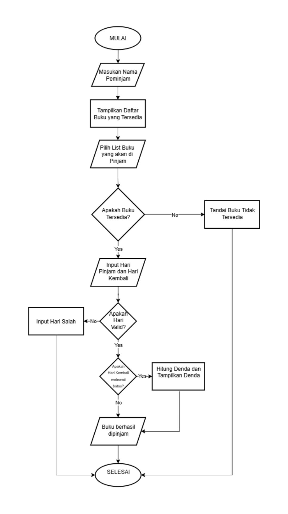

# 📘 Sistem Peminjaman Buku Perpustakaan Sekolah

Ini adalah program perpustakaan sederhana yang dibuat menggunakan bahasa pemrograman **Python**. Proyek ini disusun sebagai bagian dari kegiatan pembelajaran praktikum pada mata pelajaran Pemrograman Dasar untuk siswa kelas 10 jurusan Rekayasa Perangkat Lunak (RPL).

---

## 🎯 Tujuan Proyek

Proyek ini dirancang untuk:

- Menerapkan hasil analisis alur logika program dari **flowchart** dan **pseudocode** buatan siswa
- Memberikan pengalaman langsung dalam menerjemahkan alur pikir menjadi bentuk program nyata
- Melatih keterampilan dasar pemrograman seperti input-output, kondisi, perulangan, array/list, dan manipulasi data

---

## 🧩 Deskripsi Singkat Program

Program ini mensimulasikan sistem peminjaman buku di perpustakaan sekolah dengan fitur:

- Menampilkan daftar buku yang tersedia
- Meminta input nama peminjam
- Input hari peminjaman dan hari pengembalian (hanya hari sekolah: Senin–Jumat)
- Menghitung lama peminjaman
- Memberikan denda jika peminjaman melebihi batas waktu
- Menandai buku yang telah dipinjam sebagai tidak tersedia

---

## 🧭 Flowchart Program

Flowchart berikut menggambarkan logika utama dalam program:



---

## ⚙️ Contoh Output

### Contoh Output 1 (Tidak Terlambat)

```
=== PEMINJAMAN BUKU ===
Nama peminjam: Andi
Selamat datang Andi, di Sistem Perpustakaan Sekolah.

Daftar Buku:
1. Python Dasar
2. Algoritma dan Logika
3. Pemrograman Web

Pilih nomor buku: 1
Hari pinjam (Senin - Jumat): Senin
Hari kembali (Senin - Jumat): Rabu

Lama pinjam: 3 hari
Selamat Andi pengembalian anda berhasil. Tidak ada denda.
✅ Buku berhasil dipinjam.
```

---

### Contoh Output 2 (Terlambat dan Kena Denda)

```
=== PEMINJAMAN BUKU ===
Nama peminjam: Budi
Selamat datang Budi, di Sistem Perpustakaan Sekolah.

Daftar Buku:
1. Python Dasar
2. Algoritma dan Logika
3. Pemrograman Web

Pilih nomor buku: 2
Hari pinjam (Senin - Jumat): Selasa
Hari kembali (Senin - Jumat): Jumat

Lama pinjam: 4 hari
Selamat Budi pengembalian anda berhasil. Namun, anda terlambat 1 hari. Denda: Rp500
✅ Buku berhasil dipinjam.
```

---

### Contoh Output 3 (Hari kembali sebelum hari pinjam)

```
=== PEMINJAMAN BUKU ===
Nama peminjam: Citra
Selamat datang Citra, di Sistem Perpustakaan Sekolah.

Daftar Buku:
1. Python Dasar
2. Algoritma dan Logika
3. Pemrograman Web

Pilih nomor buku: 3
Hari pinjam (Senin - Jumat): Kamis
Hari kembali (Senin - Jumat): Rabu
Hari kembali tidak boleh sebelum hari pinjam.
```

---

### Contoh Output 4 (Input hari salah)

```
=== PEMINJAMAN BUKU ===
Nama peminjam: Dedi
Selamat datang Dedi, di Sistem Perpustakaan Sekolah.

Daftar Buku:
1. Python Dasar
2. Algoritma dan Logika
3. Pemrograman Web

Pilih nomor buku: 2
Hari pinjam (Senin - Jumat): Minggu
Hari kembali (Senin - Jumat): Selasa
Input hari salah.
```

---

## 📌 Catatan Penggunaan

- Program hanya menerima input hari kerja (Senin hingga Jumat)
- Denda dikenakan sebesar **Rp500 per hari keterlambatan** jika lebih dari 3 hari
- Data buku dan status hanya berjalan dalam satu sesi program (tidak tersimpan permanen)

---

## 📚 Lisensi & Penggunaan

Proyek ini dibuat untuk keperluan pendidikan dan pengembangan keterampilan siswa di lingkungan sekolah. Bebas digunakan dan dimodifikasi untuk tujuan pembelajaran.

---
